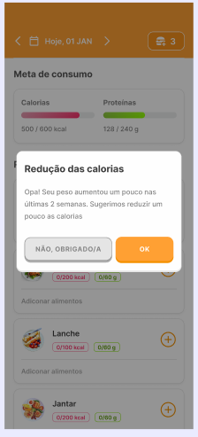
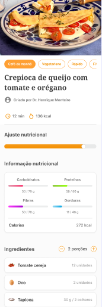
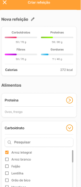
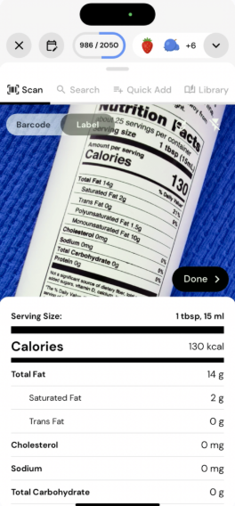
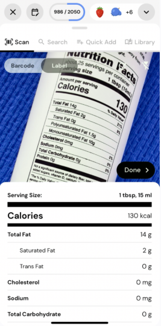
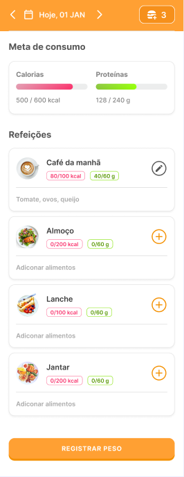

  <!-- Adicione o logo do seu app aqui. Tamanho recomendado: 200x200 -->
  <!--  -->

  # **Slimo App - Estratégias de Marketing Digital**

  ### A forma mais inteligente de alcançar seus objetivos de saúde.

  
  
  

---

## 📜 **Índice**

- [📱 Sobre o App Slimo](#-sobre-o-app-slimo)
- [🎯 Estratégias para Landing Page](#-estratégias-para-landing-page)
- [🔍 Estratégia SEO](#-estratégia-seo)
- [📈 Campanhas de Marketing Digital](#-campanhas-de-marketing-digital)
- [👥 Público-Alvo](#-público-alvo)
- [📊 Métricas de Sucesso](#-métricas-de-sucesso)
- [🚀 Próximos Passos](#-próximos-passos)

---

## 📱 **Sobre o App Slimo**

O **Slimo** é um aplicativo revolucionário de controle alimentar que utiliza inteligência artificial para criar planos alimentares personalizados. Com recursos inovadores como contagem de calorias por foto e algoritmos adaptativos, o app oferece a solução mais inteligente para quem busca emagrecer ou ganhar massa muscular.

---

## 🎯 **Estratégias para Landing Page**

### 1. **Comunicação e Tom de Voz**

#### **Título Principal (Otimizado para SEO)**
> **"Perca peso e ganhe músculos com a dieta perfeita para você"**

#### **Subtítulo (Foco no benefício)**
> **"Use a câmera do seu celular para contar calorias e deixe que nossa inteligência artificial crie o plano ideal para seus objetivos"**

#### **Tom de Voz Positivo**
> **Antes:** "Não perca seu tempo com planos desorganizados e mal formulados"
>
> **Depois:** "Cansado de dietas que não funcionam? Tenha um plano alimentar inteligente e que se adapta ao seu progresso"

### 2. **Recursos e Benefícios (Demonstração Visual)**

#### 📸 **Controle de Calorias por Foto**
*Tire uma foto da sua refeição e nossa IA te diz as calorias e os nutrientes. Comer de forma saudável nunca foi tão fácil.*
 
 

#### 🧠 **Algoritmos Inteligentes**
*Defina seu objetivo e nosso algoritmo cria metas de calorias e macronutrientes, ajustando-se semanalmente ao seu progresso.*
 
 

#### 🍽️ **Calculadora Inteligente de Refeições**
*Crie refeições com as quantidades de alimentos ajustadas automaticamente para suas metas. Chega de adivinhação na hora de montar o prato!*
 
 

#### 👨‍🍳 **Receitas Adaptáveis**
*Mais de 200 receitas deliciosas que se adaptam às suas necessidades calóricas. Coma o que você ama, sem sair da dieta.*
 

### 3. **Call to Action (CTA)**
O botão principal da landing page será claro, direto e focado na conversão:
> **"QUERO SER SLIMO"**

---

## 🔍 **Estratégia SEO**

| Cauda Curta (Alto Volume) | Cauda Longa (Alta Conversão) |
| :--- | :--- |
| • Aplicativo de dieta | • Como contar calorias por foto |
| • Contador de calorias | • Aplicativo para montar dieta personalizada |
| • Dieta para emagrecer | • Dieta com ajuste de macronutrientes |
| • Ganhar massa muscular | • Receitas fit para ganhar massa |
| • Plano alimentar | • Plano de emagrecimento com inteligência artificial |
| | • Melhor aplicativo de dieta para brasileiros |

---

## 📈 **Campanhas de Marketing Digital**

### **Google Ads**
- **Grupo 1:** "Aplicativo contador de calorias"
- **Grupo 2:** "Plano de dieta personalizado"
- **Grupo 3:** "Dieta com inteligência artificial"
- **Grupo 4:** "Receitas fit adaptáveis"

### **Facebook & Instagram Ads**
- **Interesses-alvo:** Vida saudável, Fitness, Musculação, Emagrecimento, Comida saudável, Nutrição, Academia.
- **Formato de Conteúdo:** Vídeos curtos (Reels/Shorts) mostrando o app em funcionamento, depoimentos de usuários e antes/depois.

### **Estratégia de Conteúdo (Inbound Marketing)**
1. **Blog:** Posts sobre nutrição, fitness e guias de uso do app.
2. **Redes Sociais:** Dicas rápidas, receitas em vídeo e cases de sucesso de usuários.

---

## 👥 **Público-Alvo**

| Perfil | Descrição |
| :--- | :--- |
| **Primário** | Pessoas de 18-45 anos, interessadas em emagrecimento ou ganho de massa, que buscam praticidade na alimentação através da tecnologia. |
| **Secundário** | Influenciadores fitness, nutricionistas e personal trainers que podem atuar como parceiros e embaixadores da marca. |

---

## 📊 **Métricas de Sucesso**

### **KPIs Principais**
- **Conversão:** Taxa de conversão da landing page e downloads do app.
- **Retenção:** Retenção de usuários (D1, D7, D30).
- **Engajamento:** Uso dos principais recursos do app.
- **Financeiro:** ROI das campanhas de marketing.

### **Ferramentas de Acompanhamento**
- Google Analytics
- Facebook Pixel
- Firebase Analytics
- Hotjar (heatmaps)

---

## 🚀 **Próximos Passos**

1. [ ] **Implementar** as melhorias na landing page.
2. [ ] **Configurar** as ferramentas de tracking e analytics.
3. [ ] **Criar** as campanhas de teste no Google Ads e redes sociais.
4. [ ] **Desenvolver** o calendário de conteúdo para inbound marketing.
5. [ ] **Lançar** o programa de parcerias com influenciadores.
6. [ ] **Monitorar e Otimizar** as campanhas com base nos dados coletados.

---

  **Slimo App © 2025**

